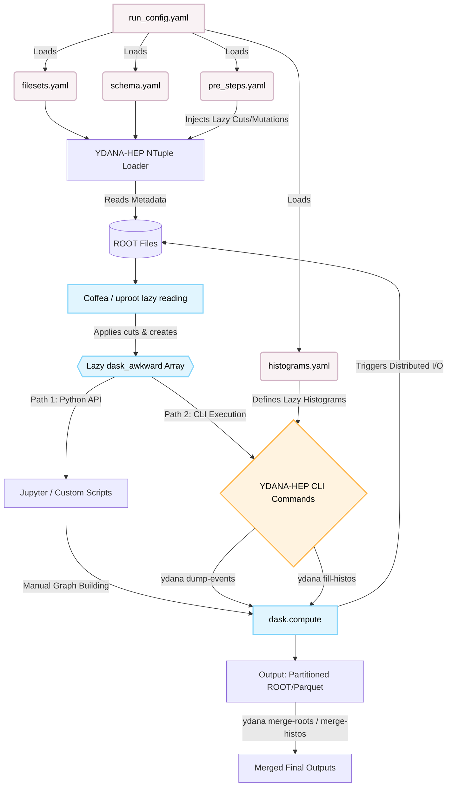

# YDANA-HEP (**Y**AML-Driven **D**ask-**A**wkward **N**tuple **A**nalyzer for **HEP**)

YDANA-HEP is a YAML configuration-driven framework for High Energy Physics (HEP) columnar data analysis.

It combines the object-oriented event structures of Coffea's `NanoEventsFactory` with the distributed processing power of `dask-awkward`. The main goal of YDANA-HEP is to provide a declarative workflow where datasets, schema mappings, preprocessing steps, and histograms are configured directly from YAML files, reducing the need to write custom execution scripts.

## Motivation

Setting up distributed analysis pipelines can sometimes require a lot of repetitive code for managing data chunks, memory, and output merging. YDANA-HEP aims to simplify this process by offering:

- **Simplified configuration:** Define your datasets, cuts, and histograms in readable YAML files.
- **Automatic scaling:** Test your configuration locally on a single file, then run the exact same YAML on a Dask cluster.
- **Lazy execution:** By leveraging `dask-awkward`, the framework only reads the specific branches you use, which helps save memory and processing time.
- **Resume-safe exports:** When saving processed events to ROOT or Parquet, YDANA-HEP writes file-by-file (partitioning). If a job is interrupted, you don't lose your progress.

## Core Features

- **YAML-first orchestration:** Manage the analysis behavior from end-to-end using config files.
- **Schema-aware data access:** Flat ROOT branches are automatically mapped into structured Awkward records.
- **Composable pipeline:** Preprocessors and selectors are applied sequentially based on your configuration.
- **Practical CLI:** Common tasks like `fill-histos`, `dump`, and `merge-dumps` are available directly via the `ydana` command.

### Full workflow map



## Installation

You can install YDANA-HEP directly from GitHub. Using `uv` is recommended for speed, but any Python virtual environment manager works:

```shell
uv venv
uv pip install "git+[https://github.com/INTREPID-hep/ydana-hep.git](https://github.com/INTREPID-hep/ydana-hep.git)@[TAG_VERSION]"
uv pip show ydana-hep
```

## Quick check

```shell
ydana --help
```

## Documentation and contribution

- Project docs: [https://intrepid-hep.github.io/ydana-hep/](https://intrepid-hep.github.io/ydana-hep/)
- Contribution guide: [CONTRIBUTING.md](CONTRIBUTING.md)
